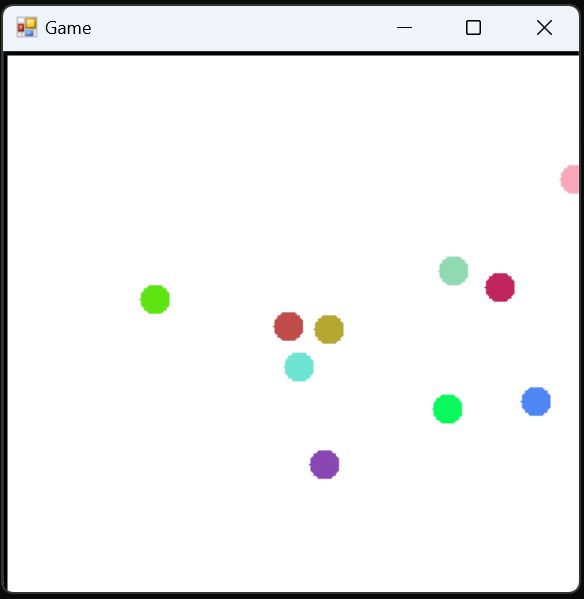

# Creat a simple 2D physics engine.
which you can use for game development and physics simulation and animation creation.

### Current Available feature
#### Object Creation
  - Circle
  - Rectangle
  - Line
#### Collision
  - Collision detection
  - with different object
  - with boundary
  - elastic and non elastic collision
#### real world simulation
  - Gravity
  - mass of object
  - velocity of object

### future feature
#### object creation
  - triangle
  - polygon
  - non moving object
  - transformation object
  - object can rotate while moving
#### Collision
  - based on object and collision object rotate
#### ray tracing
  - based on light source and placing of object creating shadow
  - lightsource can be multiple
